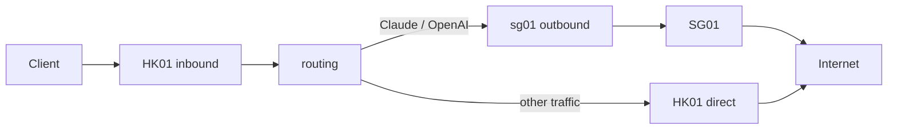

# XBoard 面板路由、Custom Outbounds 与 Multiplex

本文适用于 AriNode 的 Xray 与 sing-box Core。数据直接从 UniProxy `/api/v1/server/UniProxy/config` 获取；机器绑定使用 `/api/v2/server/config`，归一化与应用逻辑相同。

## HK01 接入，AI 流量经 SG01

SG01 必须已经运行一个 HK01 可以访问的代理服务。这里假设 SG01 提供 SOCKS5，端口为 1080。把下列数组填写到 **HK01 → 高级协议配置 → 自定义 Outbounds**：

```json
[
  {
    "tag": "sg01",
    "protocol": "socks",
    "settings": {
      "servers": [{"address": "SG01_IP", "port": 1080}]
    }
  }
]
```

在面板 **路由管理** 创建并绑定到 HK01：

```text
claude.com
*.claude.com
claude.ai
*.claude.ai
anthropic.com
*.anthropic.com
openai.com
*.openai.com
chatgpt.com
*.chatgpt.com
```

选择 **转发**，**OUTBOUND TAG** 填 `sg01`。当前 XBoard 的实际 API 动作是 `proxy`。AriNode 也接受普通规则中的 `route`，不接受未经面板实现证实的 `forward` 动作。面板下发的数据应包含：

```json
{
  "custom_outbounds": [
    {
      "tag": "sg01",
      "protocol": "socks",
      "settings": {"servers": [{"address": "SG01_IP", "port": 1080}]}
    }
  ],
  "routes": [
    {
      "id": 21,
      "match": ["claude.com", "*.claude.com", "claude.ai", "*.claude.ai", "anthropic.com", "*.anthropic.com", "openai.com", "*.openai.com", "chatgpt.com", "*.chatgpt.com"],
      "action": "proxy",
      "action_value": "sg01"
    }
  ]
}
```



保存后在下一次节点配置轮询应用，无需修改本机 JSON 或手动 restart。现有连接继续使用其建立时的出口；新连接使用新规则。普通域名与 `*.domain` 都匹配根域名及其子域名；通配符不会被当成 regexp。`full:` 是精确匹配，`regexp:` 才是正则匹配。

## Structured Custom Route Rules

如果面板版本或插件能下发 `custom_route_rules`，可使用统一结构，两个内核的字段转换由 AriNode 完成：

```json
{
  "custom_outbounds": [
    {
      "tag": "sg01",
      "protocol": "socks",
      "settings": {"servers": [{"address": "SG01_IP", "port": 1080}]}
    }
  ],
  "custom_route_rules": [
    {
      "name": "ai-sg",
      "match": {
        "domain_suffixes": ["claude.com", "claude.ai", "anthropic.com", "openai.com", "chatgpt.com"]
      },
      "action": {"type": "route", "target": "sg01"}
    }
  ]
}
```

支持 `name`、`disabled`；动作支持 `direct`、`block`、`route`。空 match 可用于显式的全匹配规则。`route.target` 可引用同一节点的自定义 tag，或保留的 `direct` / `block`。

| 统一 match 字段 | Xray | sing-box |
| --- | --- | --- |
| `domains` | `full:domain`；`*.domain` 转 suffix | `domain`；通配符转 `domain_suffix` |
| `domain_suffixes` | `domain:domain` | `domain_suffix` |
| `ip_cidrs` | `ip` | `ip_cidr` |
| `ports` | `port` | `port` + `port_range` |
| `networks` | `network` | `network` |
| `source_cidrs` | `sourceIP` | `source_ip_cidr` |
| `source_ports` | `sourcePort` | `source_port` + `source_port_range` |

端口示例：`["443", "8000-9000"]`；网络：`["tcp", "udp"]`。CIDR 可为 IPv4、IPv6，单个 IP 也可以。同一类别的多个值为 OR；域名、目标 IP、端口、网络、来源地址、来源端口等不同类别为 AND。sing-box 在域名和 IP 同时出现时生成 native logical AND 规则，以保持两种内核的行为一致。

参考面板 master 在核对时有 `custom_outbounds`、`custom_routes` 与 `multiplex`，未看到它自动输出 `custom_route_rules`。AriNode 接受该字段，但不会凭空生成面板未下发的结构化规则。普通“路由管理”的 `proxy` 用法不依赖这个扩展字段。

## 明确的优先级与本地配置

显式本地配置仍然是 local override：Xray 的 `RouteConfigPath` 路由先执行，sing-box 的 `OriginalPath` 路由先执行。本地规则继续使用本地 tag，不进行面板 namespace 重写。保留 `OutboundConfigPath`、`RouteConfigPath`、`OriginalPath` 和节点本地 `MultiplexConfig`。

面板策略内部依次执行：

1. 启用的 `custom_route_rules`，按数组顺序。
2. `custom_routes`，按数组顺序。
3. AriNode 的内置安全/默认规则阶段，当前没有额外的私网阻断规则。
4. 普通面板 `routes`，按数组顺序。
5. 本节点 direct fallback；sing-box 若显式设置了 `OriginalPath.route.final`，则保留该本地 final。

未使用新路由字段的旧 XBoard/V2Board 响应保留原有 block 审计与 DNS 处理。启用面板路由时，block 规则编译到上述顺序，避免审计 hook 抢先阻断高优先级的 direct/route。`dns` 仍进入原有 DNS 配置逻辑；DNS 配置变更采用现有节点 reload。普通规则中的 `geoip:` / `geosite:` 在启用高级路由时需要改写为内核原生规则；sing-box 1.13 已移除旧 GeoIP/Geosite 数据库，应使用本地 rule-set。

## Raw custom_routes

这是 **所选内核原生** route 对象数组，不是统一格式。选择不同内核时应使用对应字段。outbound 引用仍写面板 tag，由 AriNode 重写；不能引用另一个节点或共享 Core 的 balancer。未知字段、无效引用和无效 native rule 会拒绝更新。

Xray：

```json
{
  "custom_routes": [
    {"type": "field", "ruleTag": "ai-raw", "domain": ["domain:claude.com"], "outboundTag": "sg01"}
  ]
}
```

sing-box：

```json
{
  "custom_routes": [
    {"domain_suffix": ["claude.com"], "outbound": "sg01"}
  ]
}
```

sing-box logical rules 中的 outbound 引用也会校验和重写。可引用 `OriginalPath` 中已有的 rule-set，但此字段不用于定义新的 rule-set。raw rule 保留原生条件语义，不套用 structured rule 的 AND 归一化。

## Outbound 与代理链

| Core | 支持的 panel custom outbound 协议 |
| --- | --- |
| Xray | vmess、vless、trojan、shadowsocks、socks、http、wireguard |
| sing-box | vmess、vless、trojan、shadowsocks、socks、http、wireguard、tuic、hysteria2、anytls、mieru |

Xray 的 `settings` 使用 Xray protocol 原生格式。可在 settings 中加入 `streamSettings`，AriNode 会将它移动到 outbound 的 native streamSettings。

sing-box 的 `settings` 通常使用平铺原生字段，例如：

```json
{"tag":"sg01","protocol":"socks","settings":{"server":"SG01_IP","server_port":1080,"username":"YOUR_USER","password":"YOUR_PASSWORD"}}
```

也兼容上文 Xray 风格的单个 `servers`；VMess/VLESS 的单个 `vnext` 和单个 user；TCP、TLS、WS、gRPC、HTTP/H2、HTTPUpgrade 的基础 `streamSettings`。不能无损转换的字段直接报错，请改用 sing-box 原生平铺 `tls` / `transport`。多个 servers/users 会被拒绝，避免只使用第一项造成错误出口。TUIC、HY2、AnyTLS 使用 sing-box 的原生平铺设置。WireGuard 使用 sing-box endpoint API，转换 `secretKey` / `secret_key` / `local_address` 和 peer endpoint/publicKey/allowedIPs 等字段；也接受原生 `private_key`、`address`、`peers`。

Mieru 的 sing-box outbound 使用仓库现有的官方 SDK，支持 TCP/UDP 传输及 TCP/UDP 目的流量：

```json
{"tag":"sg01","protocol":"mieru","settings":{"server":"SG01_IP","server_port":12345,"username":"YOUR_USER","password":"YOUR_PASSWORD","transport":"tcp"}}
```

可选 `traffic_pattern` 与 SG01 匹配。Mieru UDP 传输的服务端域名解析使用系统 DNS；TCP 传输通过 sing-box dialer 解析。

代理链：

```json
[
  {"tag":"proxy-a","protocol":"socks","settings":{"servers":[{"address":"PROXY_A_IP","port":1080}]}},
  {"tag":"proxy-b","protocol":"socks","proxy_tag":"proxy-a","settings":{"servers":[{"address":"PROXY_B_IP","port":1080}]}}
]
```

路由到 `proxy-b` 时，先经 proxy-a 连接 proxy-b。Xray 使用 `proxySettings.tag`；sing-box 使用真正的 `detour`。请将 `proxy_tag` 写在 outbound 顶层，不要在 settings 中指定 detour、tag 或 proxySettings。链中的协议必须支持所需的 TCP/UDP 传输。

内部 tag 包含节点独立 namespace 和更新 generation。HK01 与 HK02 都使用 `sg01` 时互不覆盖，route target、普通 action_value、raw 引用及 proxy_tag 都映射到本节点资源。`direct` 和 `block` 是保留字，不能作为自定义 tag；tag 非空、唯一，限 1–128 个字母、数字、点、下划线或连字符，且首字符为字母或数字。缺失引用、重复 tag、代理链循环、无效端口/CIDR/network 会产生明确的节点错误，不能 silent fallback 到 direct。

**限制**：当前固定的 sing-box 版本只有 Naive inbound，没有 Naive outbound；`protocol: naive` 会明确拒绝，不会伪装成普通 HTTP proxy。QUIC 与 WireGuard 需要对应 build tags，官方发布包已包含。独立 Hysteria2 Core 不支持该面板路由功能，HY2 节点应选择 sing-box。

## Multiplex

```json
{
  "multiplex": {
    "enabled": true,
    "protocol": "smux",
    "max_connections": 4,
    "min_streams": 4,
    "max_streams": 0,
    "padding": true,
    "brutal": {"enabled": false, "up_mbps": 0, "down_mbps": 0}
  }
}
```

优先级：面板非 null 的 multiplex 对象（包括 `enabled:false`）> 本节点 `MultiplexConfig` > disabled。缺省或 null 保留本地行为。本地历史 `Enable`、`Padding`、`Brutal.Enable/UpMbps/DownMbps` 写法仍可读取，面板与本地共用同一运行模型。

sing-box 的 VLESS/VMess/Trojan/Shadowsocks inbound 真正应用 `enabled`、`padding`、`brutal`。启用 brutal 需要正数 `up_mbps` / `down_mbps`，运行环境需支持相应 TCP Brutal 能力。`protocol`、`max_connections`、`min_streams`、`max_streams` 会解析和校验，但 **属于客户端/outbound 的参数**；当前 native inbound API 没有这些字段，服务端自动识别 mux 协议，不能声称它限制了客户端的连接数或流数。客户端应同步配置；custom outbound 的原生 `settings.multiplex` 可配置完整 outbound 参数。支持的 mux 协议为 smux、yamux、h2mux。

Xray 服务端按协议处理客户端 mux，不需要这套 sing-box inbound 参数。AriNode 接受并校验面板 multiplex，不生成虚构 Xray inbound 字段，也不会仅因为提供 multiplex 对象而拒绝 Xray 节点。HY2/TUIC/AnyTLS/Mieru 等 inbound 不使用这套 sing-box mux 参数。

## 更新、错误隔离与日志

配置 ETag/body hash 包括所有新字段和普通 routes 的 action/action_value。仅路由/outbound 变化时直接替换该节点的路由与 outbound generation，保留 inbound、用户、流量统计；mux、协议/TLS/DNS 等变化使用现有的单节点 reload，不重建共享 Core。新配置完整构建成功后才发布；删除的旧 outbound 等旧连接释放后回收。DelNode 关闭本节点连接并退役本节点资源，其他节点的连接继续运行；sing-box 也拒绝已删除 inbound 的旧 mux 会话继续创建子流。

当 structured/普通规则包含目标 IP 条件时，域名目标需要先解析。Xray 的节点路由使用 IPOnDemand；sing-box 在该规则前加入保留其他匹配条件的 native resolve 动作，然后匹配 IP。请保证 Core 的 DNS 配置可用。raw custom_routes 保持内核原生语义，sing-box raw IP 规则需要自行配置 resolve 动作。

启动时无效配置仅让该绑定进入 retrying。更新失败保留旧的有效配置并重试，在状态接口显示 retrying；下一份面板修正不会被旧的 pending 配置挡住。用户撤销继续先于配置更新处理。最多 256 个自定义 outbound、4096 条顶层规则，raw logical rule 嵌套最多 32 层。

设置 AriNode 顶层 `"Log":{"Level":"debug"}` 后可看到：

```text
node=HK01 route=panel:21 outbound=sg01 msg="Panel route selected"
node=HK01 route=ai-sg outbound=sg01 msg="Panel route selected"
```

这些路由日志不包含用户 UUID、密码、私钥或 outbound settings。启动 native outbound/route 失败的错误也不打印凭据和完整 payload。规则日志中的 node 是运行标签，可能包含面板地址、节点类型和 ID。

## 验收与测试

从客户端本地 SOCKS 入口（下面假设为 1080）验证：

```sh
curl --socks5-hostname 127.0.0.1:1080 https://api.ipify.org
curl --socks5-hostname 127.0.0.1:1080 -v -I https://claude.ai
curl --socks5-hostname 127.0.0.1:1080 -v -I https://api.openai.com
```

IP 查询应返回 HK01 公网 IP。Claude/OpenAI 不一定返回出口 IP，也可能返回站点策略错误；结合 `outbound=sg01` 日志与 SG01 的连接日志/抓包确认建连路径。需要直接测出 SG01 IP 时，临时把 IP 查询域名也加入 sg01 的转发规则，等待面板同步后查询，再移除该测试规则。客户端若只发送已解析的 IP，域名规则需要 HTTP Host/TLS SNI sniffing；sing-box 高级路由使用节点本地 `EnableSniff` / `SniffOverrideDestination`（默认开启），Xray 使用已有 sniffing 配置。无法 sniff 的加密协议需要客户端传递目标域名或配置 IP 规则。

```sh
GOEXPERIMENT=jsonv2 go test ./...
GOEXPERIMENT=jsonv2 go test -p 2 -tags 'sing xray hysteria2 with_quic with_grpc with_utls with_wireguard with_acme with_gvisor' ./...
```

测试包含面板 decode/hash、普通转发、structured/raw 优先级、通配符、source/port/network 校验、代理链/环/缺失 tag、同 Core 多节点同名出口、真实 SOCKS CONNECT、默认 direct、保留旧连接的热更新、用户同步及统计、删除节点隔离、mux 覆盖与实际 smux 会话。带完整 tags 的协议测试还验证了面板 custom outbound 经本地 SG 节点进行 VMess/VLESS/Trojan/SS/HY2/TUIC/AnyTLS/Mieru 的实际 TCP/UDP 转发。这些是本地实连接验证，不代表已经完成你的 HK01/SG01 公网出口验收。

实现参考：[Xboard-Node dev](https://github.com/cedar2025/Xboard-Node/tree/0a29338e1f102a462363ce3527417029f89bab28) 的面板模型与说明，以及 [XBoard RouteController](https://github.com/cedar2025/Xboard/blob/4f48e61a2cbc6db5338872b6bdb45ef954ec1256/app/Http/Controllers/V2/Admin/Server/RouteController.php)。AriNode 继续沿用自己的动态 AddNode/DelNode、共享 Core、用户同步和统计架构。
